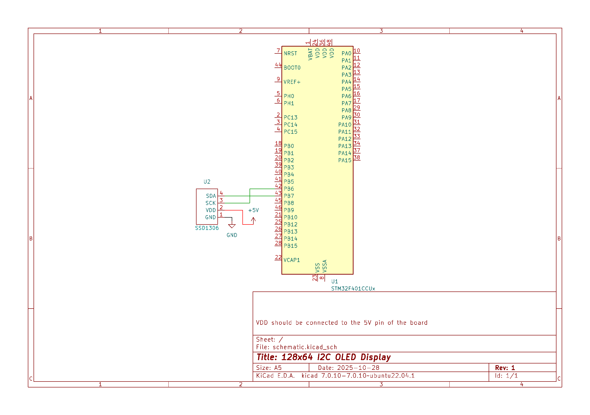

# STM32_Counter

### Compiling, Flashing and running

The repository has a ``Makefile`` that does all the compiling, linking(I think) and building.  
Make sure that the project is setup correctly to the MCU that is being used by checking the "How to setup" section of this file.  

Run the command 

``make all``  

After success, the next command to run is

``st-util``

This will flash the project and make the chip listen for a debugger on port 4242 by default.  
In a different terminal go to the repository directory again, and run this command

``arm-none-eabi-gdb main.elf``

This will start the debugger.  
Connect the debugger to the chip using

``target extended-remote :4242``

and then load the program using

``load``

and finally run it with

``continue``

## The project

A 0.96inch OLED display module that works off of an I2C connection

The purpose of this project is to setup the I2C protocol correctly without using the
STM IDE software for it.

This project was way harder than the STM32 Counter project, because of the lengthy setup process
for the I2C involving a lot of reading of the documentation and a lot of online tutorials had to be used
because the documentation does not explicitly say what the required register settings are.

## Components

The components used in project are
+ 1 x STM32F401CCU6 (Mine is a Blackpill copy)
+ 1 x SSD1306 0.96inch OLED display

### Connection schematic

## How to setup

### Linker script

There is a file in this repository named "stm32f401.ld". This is the *linker script*.  
Depending on the chip that is being used (STM32F401, STM32F031, etc.) certain values  
will differ with the ones I am using.
    
    /* Label for the program's entry point */
    ENTRY(reset_handler)

    /* Define the end of RAM and limit of stack memory */
    /* 64KB SRAM (65,536bytes = 0x10000)*/
    /* 256KB FLASH */
    /* RAM starts at address 0x20000000 */
    _estack = 0x20010000;

    /* Minimum size for stack and dynamic memory. */
    /* An error will be generated if there is
     * less than this much RAM lefover */
    /* (1KB) */
    _Min_Leftover_RAM = 0x400;

    MEMORY
    {
      FLASH( rx )         : ORIGIN = 0x08000000, LENGTH = 256K
      RAM ( rxw )         : ORIGIN = 0x20000000, LENGTH = 64K
    }

The biggest difference will be in the variable ``_estack`` which represents the end of the stack in memory.  
This variable is set to the ``RAM origin address + SRAM``. Meaning that if we have 64KB SRAM (65,536bytes), 
to access the last byte we have to address ``0x10000``. So if RAM origin is ``0x20000000`` and SRAM size  
is ``0x10000``, ``_estack`` will have the value ``0x20010000``.  

*This is very easy to mess up, and if it happens, it is very likely that the C code will not execute successfully*  
``FLASH`` and ``RAM`` should also have the correct ``LENGTH`` values.  

There are also new sections to be included that do not appear in the last linker script.
We replace the .vector_table section with a .isr_vector section. Otherwise the compiler makes its
own and everything gets screwed up.

    .isr_vector :
    {
      . = ALIGN(4);
      KEEP(*(.isr_vector))
     . = ALIGN(4);
    } >FLASH 

    .dynamic_allocations :
    {
      . = ALIGN(4);
      _ssystem_ram = .;
      . = . + _MinLeftover_RAM;
      . = ALIGN(4);
      _esystem_ram = .;
    } >RAM

I was unable to use the linker script generated by the STM IDE, but I used these 2 sections, which worked...
There could be other problems that I am not aware of yet.

### Core.S
This file setups the ``reset_handler``, which loads the program into memory and sets it up to be run.  
I have seen that this functionality has been implemented in the *Vector Table* files that ST provides,  
but this is much more readable because you don't have to work inside the 3k lines vector table.  
The only problem is that you have to remove the ``reset_handler`` implementation that is in the Vector Table.  
``.cpu`` and ``.fpu`` have to be set according to the MCU.  

### Vector table
The vector table is used to setup all the peripherals that the STM32 uses. It's a lot of lines to write by hand,  
and honestly I don't see how one could set up a complete vector table using only the reference manual,  
and thankfully there is no need to do that, because for each STM32 MCU, there is a firmware package that  
can be downloaded from the ST website which contains a complete vector table ready to use, located in:  

``Drivers/CMSIS/Device/ST/STM32[...]/Source/Templates/gcc/startup_stm32[...].s``  
# STM32_I2C_OLED
